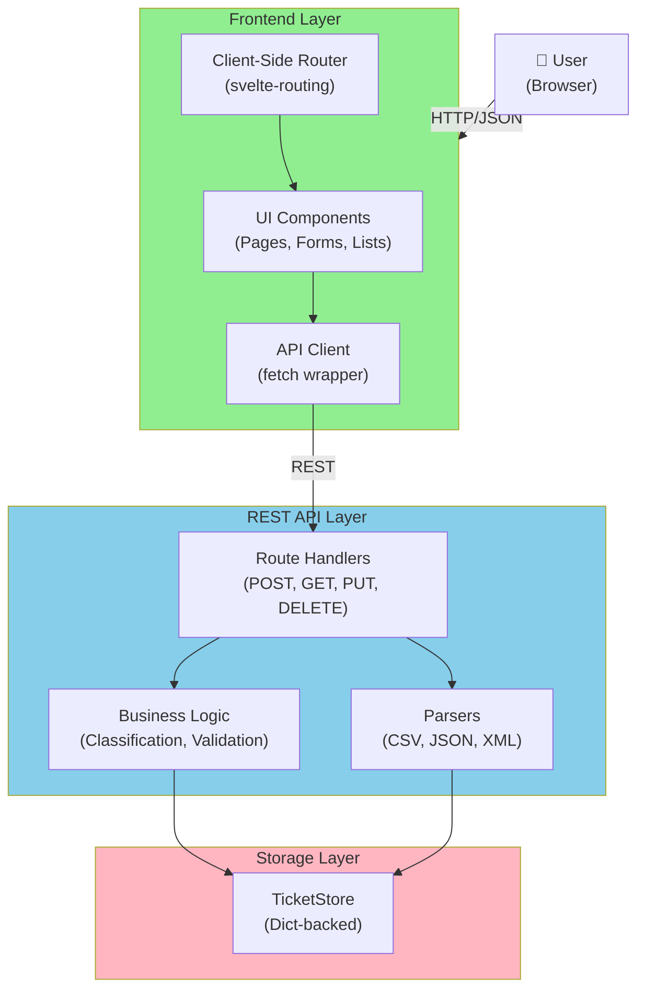
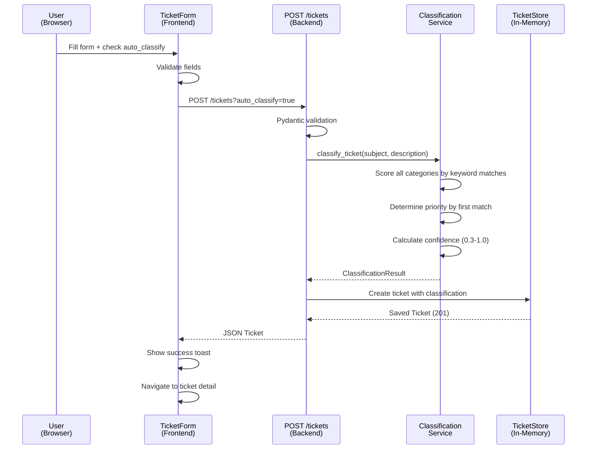
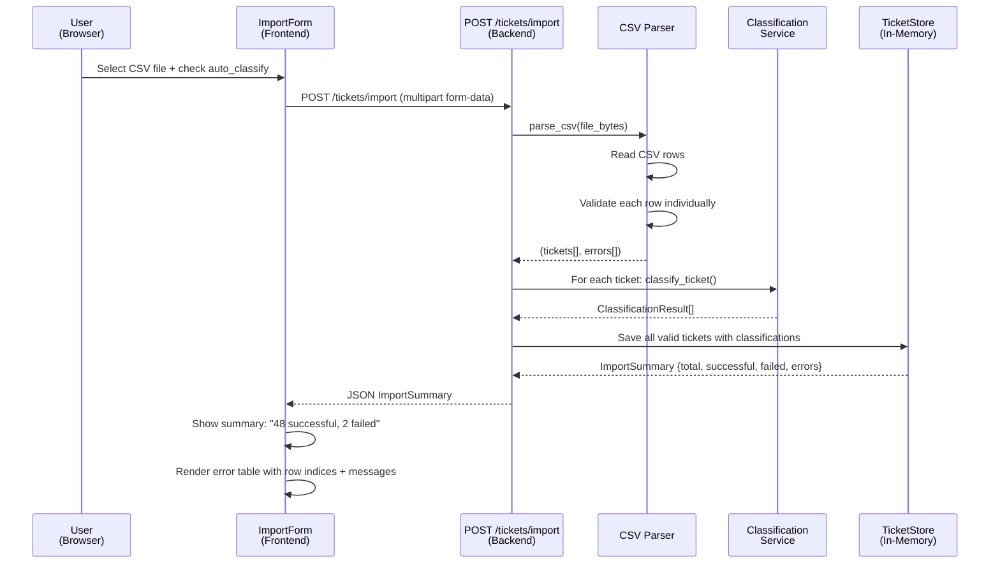
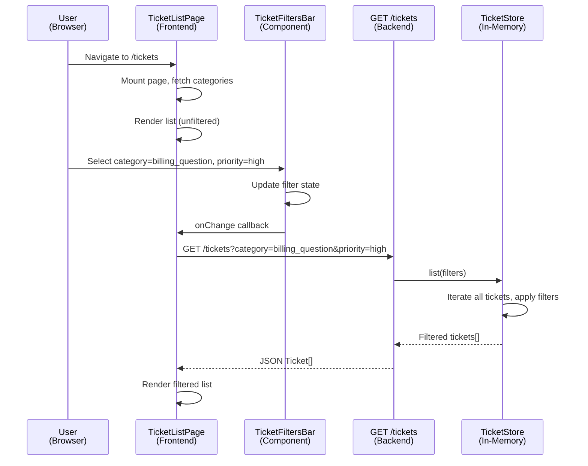

# Architecture

## Overview

The Intelligent Customer Support Ticket System is a three-tier web application designed to manage customer support tickets with automatic categorization and multi-format import. The architecture separates concerns into a frontend presentation layer (Svelte SPA), a backend REST API layer (FastAPI), and an in-memory storage layer. Data flows unidirectionally: the frontend sends HTTP requests to the API, which processes business logic, applies classification rules, and persists data to an in-memory store, then returns JSON responses for the frontend to render.

This architecture prioritizes clarity and testability over scalability. The in-memory storage model enables rapid development and comprehensive testing without database setup; the keyword-based classification ensures deterministic results suitable for homework evaluation. Each layer is independently testable and deployable during development.

---

## High-Level Architecture

---

## Component Descriptions

### Frontend Layer (Svelte + Vite)

**App.svelte** — Root component. Initializes the router and renders the current page based on the URL path.

**Router (svelte-routing)** — Implements client-side routing using the History API (non-hash URLs). Maps URL paths to page components.

**Pages** — Page components (TicketListPage, TicketFormPage, TicketDetailPage, ImportPage, CategoriesPage). Each page handles data fetching, state management, and error display.

**Components** — Reusable UI components (TicketForm, TicketList, TicketDetailView, Badge, Toast, etc.). Encapsulate presentation logic and user interactions.

**API Client (api/client.js)** — Fetch-based HTTP wrapper. Handles request construction, error parsing, and response JSON parsing. Raises ApiError on non-2xx responses.

**Stores (stores/notifications.js)** — Svelte store for toast notifications. Provides error() and success() methods; auto-dismisses after 3 seconds.

**Utils (validation.js, format.js, constants.js)** — Client-side validation mirrors backend constraints; formatting functions for dates and confidence scores; enum constants for dropdowns.

### API Layer (FastAPI)

**main.py** — FastAPI app entrypoint. Registers routers, configures CORS middleware (wide-open for local dev), and defines the RequestValidationError exception handler.

**Routers** — Two APIRouter instances:
- `routers/tickets.py` — 7 endpoints: POST/GET/PUT/DELETE /tickets, POST /tickets/import, POST /tickets/{id}/auto-classify
- `routers/categories.py` — 4 endpoints: GET /category/list, GET /category/{key}, POST /category, PUT /category/{key}

**Models (models/__init__.py)** — Pydantic schemas for request/response validation. Define Ticket (full), TicketCreate, TicketUpdate, enums (Priority, Status, Source, DeviceType), and result objects (ImportSummary, ClassificationResult, CategoryKeywords).

**Services**:
- `services/store.py` — TicketStore class. Dict-backed in-memory storage with CRUD methods and filtering (by category, priority, status, customer, agent, tag).
- `services/classification.py` — classify_ticket() pure function. Scores all categories by keyword match count, determines priority via first-match lookup, calculates confidence (0.3 to 1.0), and logs classification.
- `services/category_registry.py` — CategoryRegistry singleton. Manages runtime categories, seeded with 5 built-ins. Supports create() and add_keywords() for extensibility.

**Importers** — Format-specific parsers (CSV, JSON, XML) that return a tuple of (list[Ticket], ImportSummary). Each parser validates rows individually, collects errors per row without aborting batch, and computes a summary.

### Storage Layer

**TicketStore** — In-memory dict-backed storage with no persistence. Stores Ticket objects keyed by UUID. Auto-sets created_at, updated_at, and resolved_at timestamps. Cleared between test runs via reset() fixture.

---

## Data Flow Diagrams

### Flow 1: Create Ticket with Auto-Classification

### Flow 2: Bulk Import from CSV with Auto-Classification

### Flow 3: List Tickets with Filters

---

## Architectural Design Decisions

### 1. In-Memory Storage (No Persistence)

**Decision**: Store all tickets in a Python dict, reset on API restart. No database.

**Rationale**: Homework scope does not require data persistence. In-memory storage eliminates database setup complexity, accelerates development, and simplifies testing (state reset between test runs). Suitable for demonstrating API functionality and testing classification logic.

**Tradeoff**: Data is lost when the API restarts. Not suitable for production; would require a real database (PostgreSQL, MongoDB) for durability.

---

### 2. Keyword-Based Classification (No LLM)

**Decision**: Classification is deterministic rule-based matching on ticket subject + description. Categories and priorities determined by keyword search, not machine learning.

**Rationale**: Keyword-based classification is reproducible (same input → same output), fast (<1ms per ticket), and requires no external API calls. Suitable for homework evaluation where consistency is valued. Keywords are editable at runtime without code changes (extensible design).

**Tradeoff**: Less sophisticated than LLM-based classification. Cannot handle synonyms or context beyond exact phrase matching. Confidence score is a simple formula (0.3 baseline + 0.15 per keyword match).

---

### 3. Separate Frontend and Backend (Different Tech Stacks)

**Decision**: Frontend is a Svelte SPA (JavaScript), backend is FastAPI (Python). Two separate development servers, cross-origin communication via HTTP.

**Rationale**: Separates concerns cleanly. Frontend developers use web tools (Vite, npm, browsers); backend developers use Python tools (pytest, uvicorn). Different teams could work in parallel. Frontend is decoupled from backend implementation details.

**Tradeoff**: Requires CORS configuration. Adds network latency between layers. Requires API versioning to manage frontend/backend compatibility. Not suitable if a monolithic web framework was required.

---

### 4. Svelte + Vite (Frontend Framework Choice)

**Decision**: Frontend is built with Svelte 4 and bundled by Vite 5.

**Rationale**: Svelte is lightweight and reactive; compiles to vanilla JavaScript (smaller bundle). Vite provides fast hot module reloading (dev experience). Both have strong TypeScript support. svelte-routing enables History API-based routing (non-hash URLs, cleaner for users).

**Tradeoff**: Svelte has a smaller ecosystem than React/Vue. Less hiring pool. But suitable for a homework project focused on API consumption and responsive design, not component library breadth.

---

### 5. FastAPI (Backend Framework Choice)

**Decision**: Backend REST API built with FastAPI in Python.

**Rationale**: FastAPI is fast (async by default), has built-in request validation via Pydantic, auto-generates OpenAPI documentation, and is well-suited to Python's type hinting. Easy to write clean, testable route handlers.

**Tradeoff**: FastAPI is less mature than Django or Flask but widely adopted. Fewer third-party integrations. Not optimized for traditional template rendering (but not needed here — this is an API-only backend).

---

### 6. Dynamic Category Registry (Runtime Extensibility)

**Decision**: Categories are not a fixed enum. The CategoryRegistry singleton manages categories at runtime; new categories can be created via POST /category without code changes.

**Rationale**: Supports the homework requirement for category management (add, merge keywords). Demonstrates runtime configuration patterns. More realistic than a hardcoded enum.

**Tradeoff**: Slightly more complex than a fixed enum. Categories are not persisted, so custom categories are lost on API restart (acceptable for in-memory design).

---

### 7. Error Handling: Per-Row Collection in Bulk Import

**Decision**: When importing 50 tickets from CSV and row 5 is invalid, the importer continues processing rows 6-50 instead of aborting. All errors are collected and returned in ImportSummary.

**Rationale**: User sees success count and failure count upfront. Failed rows are reported by index with error details, allowing the user to fix and re-import. More graceful than an all-or-nothing import.

**Tradeoff**: More complex error handling logic. User might assume all imports succeeded if they don't check the error list (mitigated by UI feedback).

---

## Security Considerations (Current Implementation)

### CORS Configuration
**Current State**: CORS middleware allows all origins, all methods, all headers (`allow_origins=["*"]`). Acceptable for local development only.

**Why**: Frontend and backend run on different ports (5173 vs 8000). CORS must be permissive for the frontend to communicate. No authentication or cookies involved.

### Input Validation
**Current State**: All request payloads validated by Pydantic models before reaching route handlers. Email, string lengths, enum values, and custom category keys are validated. Invalid requests return 400 with detailed error reasons.

**Why**: Prevents malformed data from entering the store. Pydantic's validation is type-safe and performant.

### Authentication & Authorization
**Current State**: None. All endpoints are publicly accessible. No user sessions, API keys, or role-based access control.

**Why**: Homework scope. Local development environment. Not multi-tenant.

### Data Exposure
**Current State**: No sensitive data (passwords, tokens) is stored. Ticket data includes customer email and name but no PII beyond what a support agent would see.

**Why**: Suitable for the homework scenario (customer support tickets). In production, PII would require encryption at rest and HTTPS in transit.

---

## Performance Considerations (Current Implementation)

### Data Access Patterns
**List/Filter**: O(n) where n = total tickets. All filtering is done in-memory via list comprehension. No indexing. Acceptable for <10k tickets; would require database indexes at scale.

**Create/Update**: O(1) dict insert/update. No performance concern.

**Delete**: O(1) dict delete.

### Classification Performance
**per-ticket**: O(n * k) where n = number of categories, k = average keywords per category. ~5 categories * ~6 keywords = ~30 string searches. <1ms per ticket. Classification is the most expensive operation but still negligible.

### Concurrency Model
**Current State**: Single-threaded. Uvicorn spawns multiple worker processes (`--reload` uses one; production uses multiple) but each worker is serial. In-memory dict is not thread-safe without locks (not implemented).

**Tested**: E2E tests include a concurrent-operations scenario (20 simultaneous POST /tickets requests). Works due to OS-level process isolation; each Uvicorn worker handles one request at a time.

### Memory Usage
**Current State**: Unbounded. Every ticket created consumes memory; no eviction or archival. Suitable for homework; would need cleanup policies in production (e.g., archive resolved tickets after 30 days).

### Network Overhead
**Current State**: No caching, no compression. Every GET /tickets query fetches the entire ticket list and filters in-memory. Responses are JSON with full Ticket objects (timestamps, metadata, etc.).

**Optimization Path**: Add response caching for GET /category/list (rarely changes), compress responses with gzip, implement pagination for GET /tickets (offset/limit query params).

---

## Dependencies and Technology Stack Summary

| Component | Technology | Version | Purpose |
|-----------|-----------|---------|---------|
| Frontend Framework | Svelte | 4.2.20 | Reactive UI components |
| Frontend Bundler | Vite | 5.4.0 | Fast build and dev server |
| Frontend Router | svelte-routing | 2.13.0 | Client-side routing (History API) |
| Backend Framework | FastAPI | 0.115.0 | REST API and validation |
| Backend Server | Uvicorn | 0.30.6 | ASGI server for FastAPI |
| Data Validation | Pydantic | 2.9.2 | Request/response schema validation |
| Testing (Backend) | pytest | 8.3.3 | Unit and integration tests |
| Testing (E2E) | Playwright | 1.61.1+ | Browser-based end-to-end tests |
| Code Quality (Backend) | pylint | 3.3.9 | Static analysis |
| Code Quality (Frontend) | ESLint | 10.6.0 | Linting |
| Formatting | Prettier | 3.9.4 | Code formatter |

