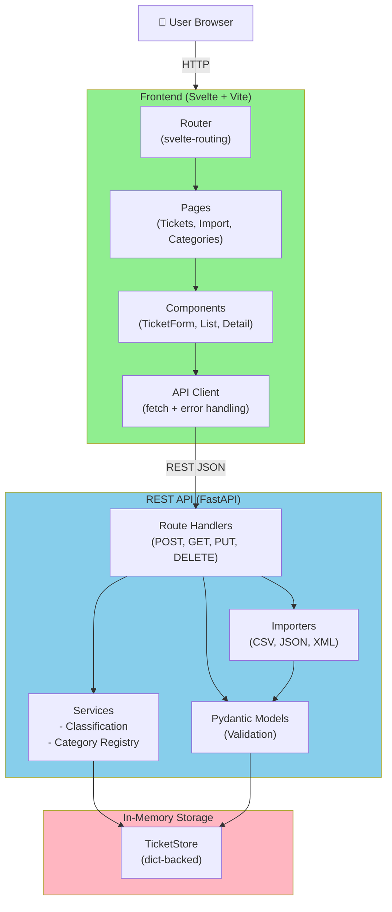

# 🎧 Homework 2: Intelligent Customer Support Ticket System

> **Student Name**: Andrii Chernenko
> **Date Submitted**: 08.07.2026
> **AI Tools Used**: Claude Code with feature-dev & RIPER plugins

---

## Project Overview

A full-stack application for managing customer support tickets with multi-format import, automatic categorization, and a responsive web UI.

---

## 🛠️ Tech Stack

| Layer                  | Technology | Version |
| ---------------------- | ---------- | ------- |
| **Backend**            | FastAPI    | 0.115.0 |
| **Backend Runtime**    | Python     | 3.9+    |
| **Frontend Framework** | Svelte     | 4.2.20  |
| **Frontend Build**     | Vite       | 5.4.0   |
| **Testing (Backend)**  | pytest     | 8.3.3   |
| **Testing (E2E)**      | Playwright | 1.61.1+ |
| **Linting (Backend)**  | pylint     | 3.3.9   |
| **Linting (Frontend)** | ESLint     | 10.6.0  |
| **Formatting**         | Prettier   | 3.9.4   |
| **Package Manager**    | npm        | 18+     |

---

## 🚀 Quick Start

```bash
# Start both API and frontend together (auto-installs dependencies)
./demo/run-all.sh
```

- **API**: http://localhost:8000
- **Frontend**: http://localhost:5173
- **Health check**: `curl http://localhost:8000/health`

**Running separately?** See [`HOWTORUN.md`](./HOWTORUN.md) for full setup instructions.

---

## 📁 Project Structure

```
homework-2/
├── src/
│   ├── api/                          # FastAPI backend
│   │   ├── main.py                   # App entrypoint, exception handlers, routes
│   │   ├── models/                   # Pydantic schemas (Ticket, Category, enums)
│   │   ├── routers/                  # API endpoints (tickets, categories)
│   │   ├── services/
│   │   │   ├── store.py              # In-memory TicketStore
│   │   │   ├── classification.py     # Keyword-based classification
│   │   │   └── category_registry.py  # Category management
│   │   ├── importers/                # Multi-format parsers (CSV, JSON, XML)
│   │   ├── requirements.txt          # Python dependencies
│   │   ├── pyproject.toml            # pylint configuration
│   │   ├── .venv/                    # Python virtual environment
│   │   └── tests/                    # 72 unit/integration tests
│   │
│   ├── app/                          # Svelte frontend (SPA)
│   │   ├── src/
│   │   │   ├── App.svelte            # Root component + router
│   │   │   ├── main.js               # Entry point
│   │   │   ├── api/                  # API client layer
│   │   │   ├── components/           # Reusable UI components
│   │   │   ├── pages/                # Route pages (TicketList, Detail, etc.)
│   │   │   ├── stores/               # Svelte stores (notifications)
│   │   │   └── utils/                # Helpers (validation, formatting)
│   │   ├── package.json              # Node dependencies
│   │   ├── eslint.config.js          # ESLint configuration
│   │   ├── .prettierrc.json          # Prettier configuration
│   │   └── node_modules/
│   │
│   └── tests/
│       ├── fixtures/                 # Shared test data (CSV/JSON/XML samples)
│       └── e2e/                      # Playwright E2E tests
│
├── demo/                             # Run scripts
│   ├── run-api.sh                    # Start API with auto-setup
│   ├── run-app.sh                    # Start frontend with auto-setup
│   └── run-all.sh                    # Start both together
│
├── README.md                         # This file
├── HOWTORUN.md                       # Complete setup & running guide
├── TASKS.md                          # Original homework requirements
└── docs/
    └── screenshots/                  # Evidence of functionality
```

---

## 🏗️ Architecture



---

## ✨ Key Features

### Ticket Management

- ✅ **Create/Edit/Delete** tickets with full metadata (customer, subject, description, priority, status)
- ✅ **Auto-Classification** — keyword-based category + priority assignment (no LLM)
- ✅ **Filtering** — by category, priority, status, customer ID, assigned agent, tags
- ✅ **Status Tracking** — automatic `resolved_at` timestamp on resolution

### Bulk Import

- ✅ **Multi-Format** — CSV, JSON, XML with per-row error collection
- ✅ **Auto-Classify** — optional flag to classify imported tickets on the fly
- ✅ **Error Reporting** — import summary with list of failed rows + reasons

### Category Management

- ✅ **Runtime Categories** — add custom categories without code changes
- ✅ **Keyword Matching** — manage keywords per category for classification
- ✅ **Reserved Fallback** — "other" category for unclassifiable tickets

### Classification System

- ✅ **Deterministic** — same input always produces same result (no randomness)
- ✅ **Confidence Scoring** — 0.3 (fallback) to 1.0 (perfect match)
- ✅ **Manual Override** — agents can override auto-assigned category/priority
- ✅ **Reasoning** — explains which keywords triggered the classification

### UI/UX

- ✅ **Responsive Design** — works on desktop (1280px+) and mobile (390px)
- ✅ **Real-Time Feedback** — toast notifications for success/error
- ✅ **Client-Side Validation** — instant field error messages
- ✅ **Loading States** — spinner feedback during API calls

---

## 🧪 Testing

### Unit & Integration Tests (Backend)

```bash
cd src/api
.venv/bin/python -m pytest -q
```

**Results**: 72 tests passing, **99% code coverage**

**Test suites:**

- Ticket API endpoints (11 tests)
- Ticket model validation (9 tests)
- CSV/JSON/XML parsing (16 tests, error handling included)
- Classification/priority logic (10 tests)
- Category registry (7 tests)
- End-to-end workflows (5 tests)
- Performance/concurrency (5 tests)

### E2E Tests (Browser)

```bash
cd src/tests/e2e
npx playwright test
```

**Results**: 6 tests passing across desktop (1280×800) and mobile (390×844) viewports

**Scenarios:**

- Complete ticket lifecycle (create → classify → resolve → delete)
- Bulk CSV import with auto-classification
- Combined filtering (category + priority)
- 20+ concurrent ticket creation
- Responsive layout (desktop/mobile)

### Linting & Formatting

**Backend (pylint):**

```bash
cd src
PYTHONPATH=.. api/.venv/bin/python -m pylint --rcfile=api/pyproject.toml api
```

**Result**: 10.00/10 ✅

**Frontend (ESLint + Prettier):**

```bash
cd src/app
npm run lint      # Check for issues
npm run format    # Auto-fix
```

**Result**: All checks passing ✅

---

## 📚 Documentation

This README is for **developers building/modifying the system**. For other audiences:

| Document                         | Audience        | Content                                                |
| -------------------------------- | --------------- | ------------------------------------------------------ |
| **[HOWTORUN.md](./HOWTORUN.md)** | All             | How to install, run, and troubleshoot                  |
| **API_REFERENCE.md**             | API consumers   | All endpoints, request/response examples, cURL samples |
| **ARCHITECTURE.md**              | Technical leads | Design decisions, data flows, security/performance     |
| **TESTING_GUIDE.md**             | QA engineers    | Test pyramid, test data locations, benchmarks          |

---

## 🔧 Development Workflow

### Starting the dev servers

```bash
./demo/run-all.sh    # Both in one terminal
# OR
./demo/run-api.sh    # Terminal 1: API (auto-reload on file changes)
./demo/run-app.sh    # Terminal 2: Frontend (Vite hot reload)
```

### Adding a backend dependency

```bash
cd src/api
.venv/bin/pip install <package>
# Then add to requirements.txt manually or use:
.venv/bin/pip freeze > requirements.txt
```

### Adding a frontend dependency

```bash
cd src/app
npm install <package>
```

### Database/Storage

- **No persistence** — in-memory storage resets when API restarts
- **Test isolation** — pytest fixture resets state between tests
- **E2E isolation** — each test uses unique customer_id to avoid cross-test interference

---

## 📊 Key Metrics

| Metric                       | Value                         |
| ---------------------------- | ----------------------------- |
| Backend test coverage        | 99%                           |
| Unit tests (pytest)          | 72                            |
| E2E tests (Playwright)       | 6                             |
| Code quality (pylint)        | 10.00/10                      |
| Linting (ESLint)             | ✅ Clean                      |
| Formatting (Prettier)        | ✅ Aligned                    |
| API endpoints                | 10                            |
| Supported import formats     | 3 (CSV, JSON, XML)            |
| Ticket categories (built-in) | 5 + unlimited custom          |
| Priority levels              | 4 (urgent, high, medium, low) |

---

## ⚡ Performance Notes

- **Classification** — O(n\*k) where n=categories, k=keywords; <1ms per ticket
- **Filtering** — O(m) where m=total tickets; in-memory, no database overhead
- **Import** — parallel validation, per-row error collection (no early exit)
- **Concurrency** — supports 20+ simultaneous requests (tested via E2E)
