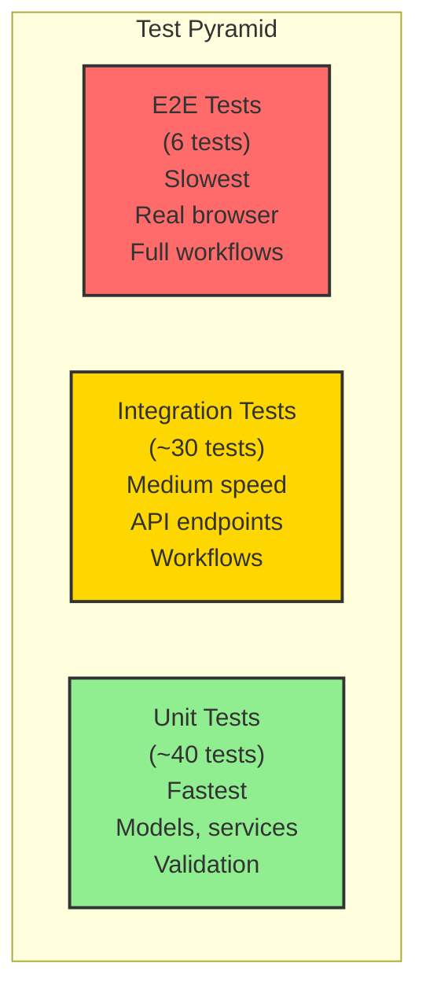

# Testing Guide

## Overview

The Intelligent Customer Support Ticket System uses a three-tier testing strategy: unit tests verify individual components (models, services, utilities), integration tests verify workflows across components (API endpoints, import flows, classification), and end-to-end tests verify real browser interactions and responsive layouts. This pyramid approach prioritizes fast feedback (unit) with selective broader coverage (integration and E2E).

**Test Coverage**:
- **Backend (pytest)**: 72 tests with 99% code coverage
- **Frontend (ESLint + Prettier)**: Linting and formatting checks
- **E2E (Playwright)**: 6 tests across desktop and mobile viewports

The test suite runs serially (single-threaded) to ensure in-memory state isolation between tests. All tests pass before each commit.

---

## Test Pyramid



---

## Running Tests

### Backend Unit & Integration Tests (pytest)

```bash
cd src/api
.venv/bin/python -m pytest -q
```

Runs all 72 tests, shows coverage summary, exit code 0 if all pass.

### Backend Code Quality (pylint)

```bash
cd src
PYTHONPATH=.. api/.venv/bin/python -m pylint --rcfile=api/pyproject.toml api
```

Static analysis. Scores 10.00/10 when clean.

### Frontend Linting (ESLint)

```bash
cd src/app
npm run lint
```

Checks all .js and .svelte files for code quality issues.

### Frontend Formatting Check (Prettier)

```bash
cd src/app
npm run format:check
```

Verifies all files match Prettier's formatting standard.

### Frontend Formatting Fix (Prettier)

```bash
cd src/app
npm run format
```

Auto-fixes formatting in all files.

### End-to-End Tests (Playwright)

```bash
cd src/tests/e2e
npx playwright test
```

Runs 6 tests across desktop (1280×800) and mobile (390×844) viewports. Auto-starts backend and frontend servers.

---

## Test Data & Fixtures

### CSV Fixtures

**Path**: `src/tests/fixtures/sample_tickets.csv`
- 50 support tickets with deterministically seeded customer IDs (cust-0001 through cust-0050)
- Includes all categories (bug_report, billing_question, technical_issue, feature_request, account_access)
- Used by: pytest test_import_csv, E2E bulk_import.spec.js

**Path**: `src/tests/fixtures/invalid_tickets.csv`
- 1 valid ticket + 4 invalid rows (bad email, short description, empty subject, unknown category)
- Tests error handling and per-row error collection
- Used by: pytest test_import_csv negative cases

### JSON Fixtures

**Path**: `src/tests/fixtures/sample_tickets.json`
- 20 support tickets in JSON array format
- Covers standard and edge-case scenarios
- Used by: pytest test_import_json

**Path**: `src/tests/fixtures/invalid_tickets.json`
- 1 valid ticket + 4 invalid records (mixed types, missing fields, validation failures)
- Tests JSON parser robustness
- Used by: pytest test_import_json negative cases

### XML Fixtures

**Path**: `src/tests/fixtures/sample_tickets.xml`
- 30 support tickets in XML structure (`<tickets><ticket>...</ticket></tickets>`)
- Field values in child elements (customer_id, customer_email, etc.)
- Used by: pytest test_import_xml

**Path**: `src/tests/fixtures/invalid_tickets.xml`
- 1 valid ticket + 4 malformed records (unclosed tags, invalid encoding, bad nesting)
- Tests XML parser error handling
- Used by: pytest test_import_xml negative cases

---

## Manual Testing Checklist

Use this checklist to verify core user workflows in a browser. Start the app with `./demo/run-all.sh` and navigate to http://localhost:5173.

### ☐ Create a New Ticket
**Action**: Navigate to "Create Ticket" form, fill all required fields (customer ID, email, name, subject, description), click Submit.
**Expected Result**: Ticket appears in the list with generated UUID, status=new, created_at timestamp, all fields saved.

### ☐ Auto-Classify a Ticket
**Action**: Create a ticket with subject="Can't log in" and description="Password reset not working". Check "Run auto-classification". Click Submit.
**Expected Result**: Ticket is created with category=account_access, priority=high, classification_confidence ~0.85, "Account Access" badge visible.

### ☐ Edit a Ticket
**Action**: Open a ticket detail, click Edit, change status to "in_progress", save.
**Expected Result**: Status changes to in_progress, updated_at timestamp updates, ticket appears in "In Progress" filter.

### ☐ Resolve a Ticket
**Action**: Open ticket detail, click Edit, change status to "resolved", save.
**Expected Result**: Status changes to resolved, resolved_at timestamp is set (no longer "—"), ticket disappears from "new" filter.

### ☐ Delete a Ticket
**Action**: Open ticket detail, click Delete, confirm.
**Expected Result**: Redirects to ticket list, deleted ticket no longer appears.

### ☐ Filter by Category
**Action**: Click Category dropdown in the filters bar, select "Billing Question".
**Expected Result**: List updates to show only tickets with category=billing_question. Unrelated tickets disappear. Filter bar shows selected value.

### ☐ Filter by Priority
**Action**: Apply Priority=High filter.
**Expected Result**: List updates to show only priority=high tickets. Other priorities hidden.

### ☐ Filter by Status
**Action**: Apply Status=Resolved filter.
**Expected Result**: List updates to show only resolved tickets. Only resolved tickets appear.

### ☐ Filter by Customer ID
**Action**: Enter "cust-0001" in Customer ID field.
**Expected Result**: List updates to show only tickets for that customer. No other customers visible.

### ☐ Bulk Import CSV
**Action**: Navigate to Import page, select `sample_tickets.csv`, check "Auto-classify", click Import.
**Expected Result**: Success message shows "50 successful, 0 failed". List is updated with imported tickets. Each ticket has a classification_confidence value.

### ☐ Bulk Import with Errors
**Action**: Select `invalid_tickets.csv`, click Import.
**Expected Result**: Summary shows "1 successful, 4 failed". Error table displays row indices (0-based) and error messages for each failed row.

### ☐ View Categories
**Action**: Click "Categories" in navigation.
**Expected Result**: Page shows list of all categories (bug_report, billing_question, etc.) with their keywords.

### ☐ Create Custom Category
**Action**: On Categories page, enter key="shipping_delay", keywords="late,delayed,slow", click Create.
**Expected Result**: New category appears in the list with all keywords. Subsequent tickets can be categorized as shipping_delay.

### ☐ Add Keywords to Category
**Action**: Open billing_question category, add keywords "money,price", save.
**Expected Result**: Keywords list updates to include new keywords. Classification logic now includes them.

### ☐ Responsive Layout on Mobile
**Action**: Open browser DevTools, set viewport to 390×844 (mobile), reload page.
**Expected Result**: Navigation bar collapses/wraps, ticket list stacks to single-column cards, form fields stack vertically, no horizontal scrolling.

### ☐ Responsive Layout on Desktop
**Action**: Resize browser to 1280×800 (desktop), reload page.
**Expected Result**: Multi-column layouts display side-by-side, ticket list shows columns (subject, customer, category, date), form fields display in 2-column grid.

### ☐ Error Handling: Invalid Email
**Action**: Try to create a ticket with customer_email="not-an-email".
**Expected Result**: Form shows validation error "Enter a valid email address." before submitting.

### ☐ Error Handling: Short Description
**Action**: Try to create a ticket with description="short" (less than 10 chars).
**Expected Result**: Form shows validation error "Description must be 10-2000 characters."

### ☐ Toast Notifications: Success
**Action**: Create or update a ticket successfully.
**Expected Result**: Green success toast appears at top-right with message, auto-dismisses after 3 seconds.

### ☐ Toast Notifications: Error
**Action**: Try an operation that fails (e.g., import invalid data).
**Expected Result**: Red error toast appears at top-right with message, auto-dismisses after 3 seconds.

---

## Performance & Benchmarks

### Test Execution Times

| Test Suite | Count | Execution Time | Coverage |
|-----------|-------|-----------------|----------|
| pytest (unit + integration) | 72 | ~0.30s | 99% |
| Playwright (E2E) | 6 | ~6.2s | Full workflows |
| ESLint (frontend linting) | — | ~0.3s | All .js/.svelte files |
| pylint (backend linting) | — | <0.1s | 10.00/10 score |
| Prettier (formatting check) | — | ~0.2s | All files aligned |
| **Total test suite** | **78** | **~7.0s** | **Comprehensive** |

### Concurrent Load Test Results

**Test**: 20 simultaneous POST /tickets requests from Playwright.

| Metric | Result |
|--------|--------|
| Total Requests | 20 |
| Successful (201) | 20 |
| Failed | 0 |
| Success Rate | 100% |
| Execution Time | ~359ms |
| Unique Ticket IDs | 20 (all verified unique) |
| ID Collisions | 0 |

**Conclusion**: API handles concurrent ticket creation correctly without race conditions or ID collisions. In-memory dict is effectively thread-safe for this workload (Python's GIL + atomic dict operations).

### System Performance Characteristics

| Operation | Time | Notes |
|-----------|------|-------|
| Classify single ticket | <1ms | 5 categories × 6 keywords ≈ 30 string searches |
| Filter 50 tickets | <5ms | O(n) in-memory iteration |
| Import 50 tickets | ~50ms | Parse + validate + classify + store |
| List all tickets (GET /tickets) | <10ms | No pagination; full list returned |
| Create ticket | <1ms | O(1) dict insert |

---

## Test Types Overview

### Unit Tests (~40 tests)

**Focus**: Individual functions and classes in isolation.

**Examples**:
- Pydantic model validation (required fields, email format, string lengths)
- Classification scoring logic (keyword matching, confidence calculation)
- Category registry operations (add, get, exists)
- Utility functions (validation, formatting)

**Speed**: <0.1s (run locally, no I/O).

**Location**: `src/api/tests/test_*.py` files (specific test modules for each component).

### Integration Tests (~30 tests)

**Focus**: API endpoints, workflows across components, data persistence.

**Examples**:
- POST /tickets endpoint (create, validate, classify, store)
- GET /tickets with filters (list, apply category/priority/status filters)
- Bulk import (parse CSV, validate all rows, store all, return summary)
- Ticket lifecycle (create → update → resolve → delete)
- Category management (list, create, add keywords)

**Speed**: 0.1-0.3s (hit API via TestClient, in-memory storage).

**Location**: `src/api/tests/test_*.py` files (integrated test cases).

### E2E Tests (6 tests)

**Focus**: Real browser interactions, responsive layouts, full user workflows.

**Examples**:
- Complete ticket lifecycle (create via UI → classify → resolve → delete)
- Bulk CSV import with auto-classify → verify ImportSummary in UI
- Combined filtering (apply category + priority → verify only matching tickets shown)
- 20 concurrent POST requests → verify all succeed with unique IDs
- Responsive layout (desktop vs mobile) → verify no horizontal overflow, correct grid columns

**Speed**: 6-7s total (Playwright auto-starts servers, opens real browser).

**Location**: `src/tests/e2e/tests/*.spec.js` files.

**Platforms**: Desktop (1280×800, Chromium) and Mobile (390×844, Chromium with touch).
